# Treinamento Métodos Gaussianos de Aprendizagem de Máquina
___
## Exercício Aula 1

> Escreva um programa no R para gerar números do vetor aleatório
normalmente distribuído com variâncias todas iguais a 1 (um) e
correlações todas iguais a um dos valores no conjunto
{−0, 9; 0, 0; 0, 9; 0, 99}, e varie o tamanho das amostras geradas para
cada matriz de covariâncias (por exemplo, 100, 1000, etc).  
Considere
uma normal trivariada para este exercício. Faça diversos gráficos para
analisar os conjuntos de dados gerados. Por exemplo box-plot,
histogramas, qq-plot, dispersão dois a dois, etc. É importante neste
exercício que você trabalhe com a matriz de dados de acordo com a
parte teórica da matéria, ou seja, salve os dados gerados em uma
matriz p × n.  
Dica: verificar as funções boxplot, *hist*, *qqnorm* e *plot* do programa R.

### Solução
O exercício solicita uma distribuição normal trivariada. Desta forma, o número *p* de variáveis é **3**.  
No enunciado também foi definido que a variância **s** é **1**.  
Assim, temos como variáveis iniciais:  

| Variável | Valor |  
| -------- |:-----:|  
| *p*      | 3     |  
| *s*      | 1     |  
| *r*      | {-.9,0,.9,.99} |  
| *n*      | {100,1000,10000} |  

Para iniciar o exercício, primeiro é preciso encontrar a matriz de covariância **&#931;**. Ela é obtida pela equação   
Os passos para calcular a matriz **&#931;** a partir da Variância e Correlação são:
1. Criar uma matriz de correlação **R**
  1. Definir uma matriz *p*X*p* com valores iguais à correlação escolhida
  2. Definir a diagonal da matriz **R** para 1, pois a matriz de correlação tem diagonal 1 (correlação entre um elemento e ele mesmo **r<sub>ii<sub>**)
2. Calcular o desvio padrão **&#961;** igual a 
3. Calcular   igual a matriz diagonal de **&#961;**
4. Calcular a matriz de covariância **&#931;** =   

A matriz de covariância é simétrica **&#931;** = **&#931;**<sup>'</sup> e positiva definida - seus auto valores são todos maiores ou iguais a 0 (zero)  
Dessa forma, a primeira opção de *r*=-.9 gera uma matriz que não é positiva definida, portando, este valor de correlação é descartado.  
Para gerar a normal trivariada, utiliza-se a função `rmvnorm` do pacote **mvtnorm**.

```R
## num.amostras é o número de amostras escolhido entre 100,1000,10000
## mean = c(0,0,0) centra a normal na origem
## sigma é a matriz **&#931;** calculada
w <<- rmvnorm(num.amostras,mean = c(0,0,0),sigma = Sigma)
head(w)
        [,1]        [,2]        [,3]
[1,] -0.1090921 -0.03828476 -0.11619513
[2,]  0.1533679  0.18842449  0.06760031
[3,] -0.8254751 -0.89191302 -1.10961539
[4,] -1.2262424 -1.06567391 -1.16657697
[5,] -1.6802752 -1.72108468 -1.79692971
[6,]  1.3113248  1.51770857  1.39245846
```  
O script R [Exercicio 01](./exercicio_01.R) define 3 funções para calcular os parâmetros necessários para o exercício e uma função que compara a correlação da amostra com a correlação original:  
* analisa_matriz: recebe os índices escolhidos para correlação e tamanho da normal e se deve-se salvar os gráficos em arquivos .PNG;
* calcula.sigma: recebe um valor de variância e um de correlação e calcula a matriz de covariância **&#931;** conforme explicação acima;
* matriz.eh.positiva.definida: valida se a matriz **&#931;** é positiva definida
* compara.correlacoes: recebe o sigma calculado, a normal gerada e a correlação original e gera um dataframe com a covariancia da normal, a covariância calculada, o número de amostras e a correlação solicitada

Além disso, o script faz a análise de cada correlação (-.9,0,.9,.99) para cada tamanho da normal (100,1000,10000).  

A pasta [images](./images) contém os gráficos obtidos a partir da execução combinada de correlação e tamanho da normal. Os tipos de gráfico são:
* boxplot
* densidade (curva de densidade do histograma)
* hist (histograma)
* pairs (dispersão dois a dois)
* qqnorm

O padrão de nomeação dos arquivos é `<tipo de grafico>_<numcorrelacao>_<tamanho>.png`.  

### Análise  
Para início da análise, a função analisa.matriz retorna um dataframe com uma linha contendo:
* Correlação encontrada na normal
* Matriz **&#931;** calculada durante a análise
* O número de linhas da amostra e
* A correlação utilizada na análise

Para cada análise, o retorno é concatenado no data.frame comparacao, para avaliação.  
O resultado da comparação segue a seguir. Ele é uma lista de 9 combinações entre correlações {0, .9, .99} (A primeira correlação -.9 foi excluída, pois gera uma matriz **&#931** que não é positiva definida) e tamanhos da amostra {100, 1000, 10000}.
```R
> comparacao
$`0.100`
  cov.normal.1 cov.normal.2 cov.normal.3 sigma.1 sigma.2 sigma.3 num.amostra correlacao
1   1.00000000   0.06480644   -0.1555318       1       0       0         100          0
2   0.06480644   1.00000000   -0.1060261       0       1       0         100          0
3  -0.15553185  -0.10602614    1.0000000       0       0       1         100          0

$`0.9.100`
   cov.normal.1 cov.normal.2 cov.normal.3 sigma.1 sigma.2 sigma.3 num.amostra correlacao
10    1.0000000    0.9880420    0.9875237     1.0     0.9     0.9         100        0.9
11    0.9880420    1.0000000    0.9956702     0.9     1.0     0.9         100        0.9
12    0.9875237    0.9956702    1.0000000     0.9     0.9     1.0         100        0.9

$`0.99.100`
   cov.normal.1 cov.normal.2 cov.normal.3 sigma.1 sigma.2 sigma.3 num.amostra correlacao
19    1.0000000    0.9998499    0.9998233    1.00    0.99    0.99         100       0.99
20    0.9998499    1.0000000    0.9999277    0.99    1.00    0.99         100       0.99
21    0.9998233    0.9999277    1.0000000    0.99    0.99    1.00         100       0.99

$`0.1000`
  cov.normal.1 cov.normal.2 cov.normal.3 sigma.1 sigma.2 sigma.3 num.amostra correlacao
4  1.000000000 -0.008810824  -0.01841990       1       0       0        1000          0
5 -0.008810824  1.000000000   0.03317981       0       1       0        1000          0
6 -0.018419895  0.033179807   1.00000000       0       0       1        1000          0

$`0.9.1000`
   cov.normal.1 cov.normal.2 cov.normal.3 sigma.1 sigma.2 sigma.3 num.amostra correlacao
13    1.0000000    0.9907845    0.9886263     1.0     0.9     0.9        1000        0.9
14    0.9907845    1.0000000    0.9946763     0.9     1.0     0.9        1000        0.9
15    0.9886263    0.9946763    1.0000000     0.9     0.9     1.0        1000        0.9

$`0.99.1000`
   cov.normal.1 cov.normal.2 cov.normal.3 sigma.1 sigma.2 sigma.3 num.amostra correlacao
22    1.0000000    0.9998456    0.9998073    1.00    0.99    0.99        1000       0.99
23    0.9998456    1.0000000    0.9999227    0.99    1.00    0.99        1000       0.99
24    0.9998073    0.9999227    1.0000000    0.99    0.99    1.00        1000       0.99

$`0.10000`
  cov.normal.1 cov.normal.2 cov.normal.3 sigma.1 sigma.2 sigma.3 num.amostra correlacao
7  1.000000000 -0.006753944  0.001033709       1       0       0       10000          0
8 -0.006753944  1.000000000  0.011029030       0       1       0       10000          0
9  0.001033709  0.011029030  1.000000000       0       0       1       10000          0

$`0.9.10000`
   cov.normal.1 cov.normal.2 cov.normal.3 sigma.1 sigma.2 sigma.3 num.amostra correlacao
16    1.0000000    0.9895443    0.9880605     1.0     0.9     0.9       10000        0.9
17    0.9895443    1.0000000    0.9944100     0.9     1.0     0.9       10000        0.9
18    0.9880605    0.9944100    1.0000000     0.9     0.9     1.0       10000        0.9

$`0.99.10000`
   cov.normal.1 cov.normal.2 cov.normal.3 sigma.1 sigma.2 sigma.3 num.amostra correlacao
25    1.0000000    0.9998445    0.9997931    1.00    0.99    0.99       10000       0.99
26    0.9998445    1.0000000    0.9999157    0.99    1.00    0.99       10000       0.99
27    0.9997931    0.9999157    1.0000000    0.99    0.99    1.00       10000       0.99
```  

As colunas cov.normal.{1,2,3} representam a matriz de covariância da normal e sigma.{1,2,3} representam a matriz **&#931;**.  
Cada grupo $`r.rr.nnnnn` representa uma combinação de r.rr correlação e nnnn tamanho da amostra.  

Avaliando as matrizes, é possível observar que a matriz de covariância **S** das normais geradas respeitam a matriz **&#931;** calculada para cada correlação. É possível observar que os casos com tamanho de amostra maior, as matrizes se aproximam mais.  

A próxima análise é a dispersão dois a dois da normal gerada.  
O primeiro grupo de comparação é considerando a correlação **r** = 0.0. As 3 imagens a seguir mostram que a dispersão entre as variáveis *p1*, *p2* e *p3* é simétrica entre os eixos X e Y além de se centrarem no zero. A dispersão se assemelha a um círculo, pois não há correlação entre as 3 normais geradas (*p1*, *p2* e *p3*), elas apenas possuem a mesma variância em relação à média 0,0.

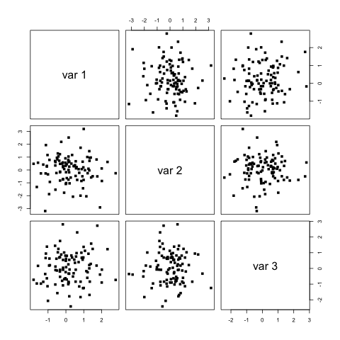  
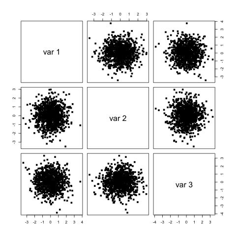  
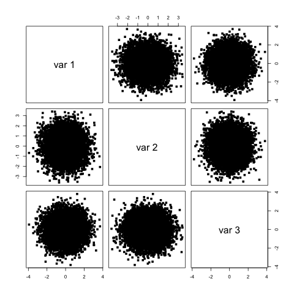  

Com o valor de correlação **r** = .9, as imagens a seguir mostram dispersões se aproximam de uma reta ascendente. Isso é dado porque Y é uma função linear de X. Como a covariância dos elementos é próximo de 1, mas ainda distante .1, a dispersão ainda apresenta a forma de uma elipse, mais visível nas amostras maiores.

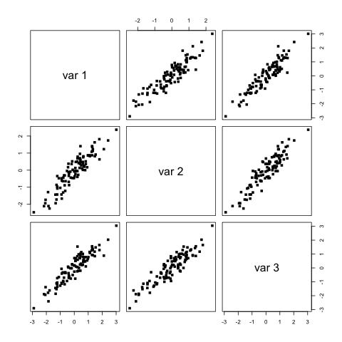    
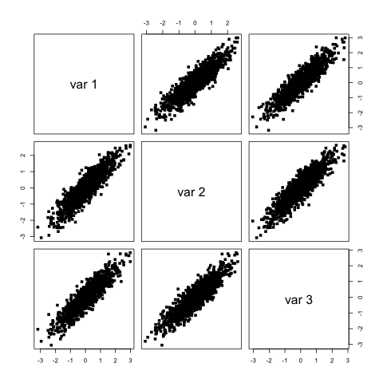  
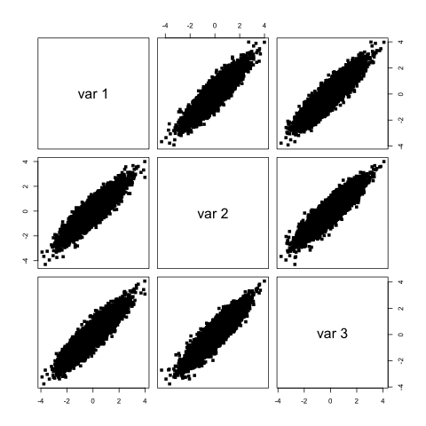  

Finalmente, com a correlação **r** = .99, as imagens a seguir mostram dispersão muito próximas de uma reta ascendente. Como a covariância dos elementos está a .01 de 1, nas amostras maiores, é possível visualizar claramente a reta ascendente.

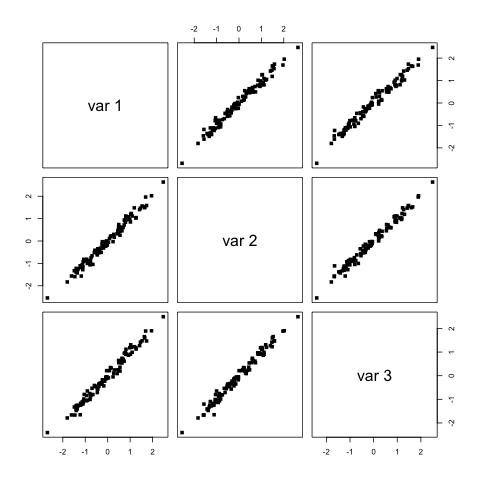  
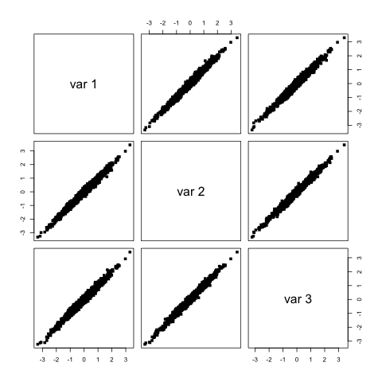  
  

Após conferir que as dispersões respeitam a correlação associada, podemos avaliar graficamente as normais geradas e validar se elas se comportam como normais teóricas.  
A primeira avaliação é sobre os quantis. Para isso, as funções `qqnorm` e `qqline` desenham gráficos da relação dos quantis teóricos, baseados no número de observações da amostra, e dos quantis encontrados na amostra.

Os gráficos a seguir, agrupados pelas correlações utilizadas {0, .9, .99} mostram que as normais geradas respeitam a normalidade pois acompanham a reta teórica traçada.

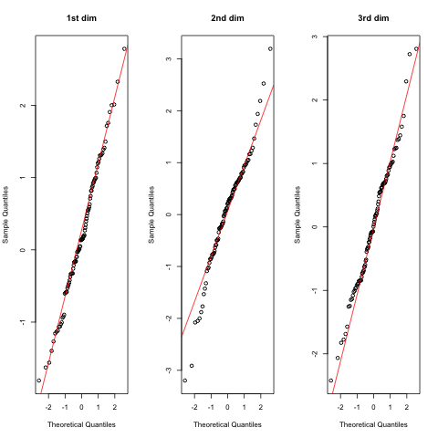  
  
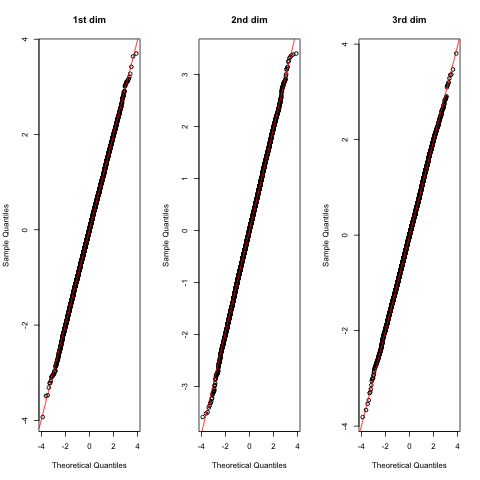  
*Gráfico de comparação Quantil-Quantil para r=0.0 e amostras 100, 1000 e 10000*

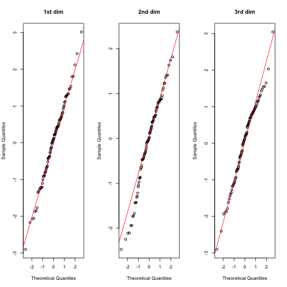  
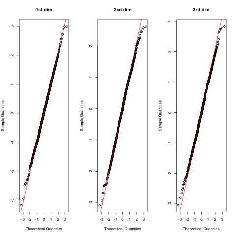  
  
*Gráfico de comparação Quantil-Quantil para r=0.9 e amostras 100, 1000 e 10000*

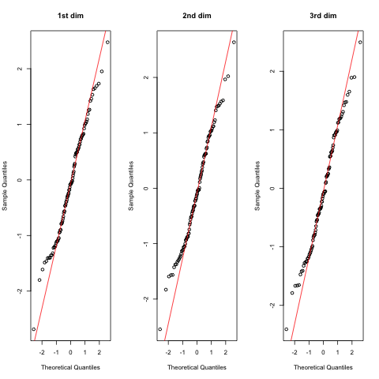  
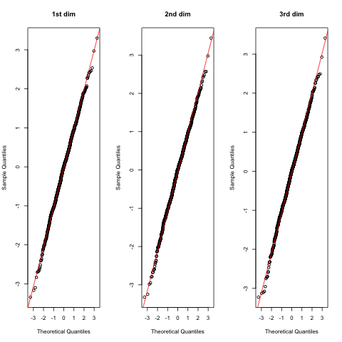  
  
*Gráfico de comparação Quantil-Quantil para r=0.99 e amostras 100, 1000 e 10000*

É possível perceber que, mesmo com correlação **r**=0, as normais geradas se comportam dentro da normalidade.

A mesma observação pode ser feita quando analisamos os gráficos de boxplot das distribuições geradas. Todos os gráficos a seguir apresentam a mediana próxima da média 0.0, simetria no primeiro e segundo quantil **&#961;** e 2***&#961;**. Além disso, poucos pontos estão fora do 3o. desvio padrão (3***&#961;**).

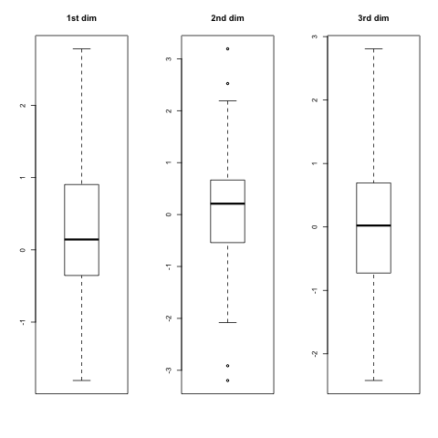  
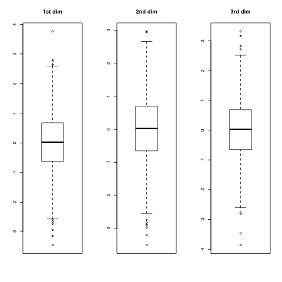  
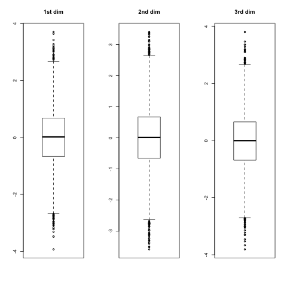  
*Gráfico Boxplot  para r=0.0 e amostras 100, 1000 e 10000*

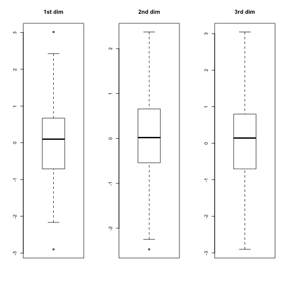  
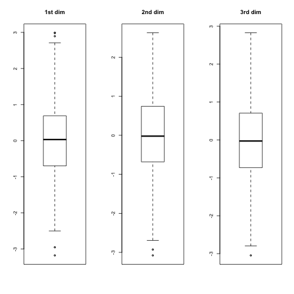  
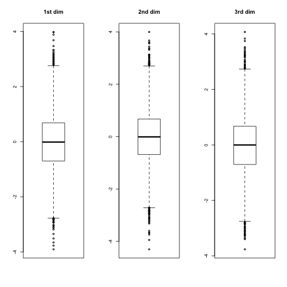  
*Gráfico Boxplot para r=0.9 e amostras 100, 1000 e 10000*

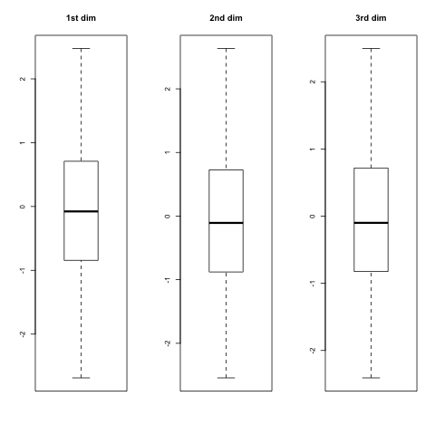  
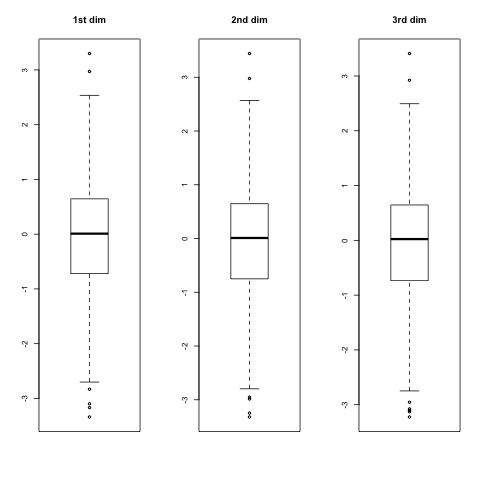  
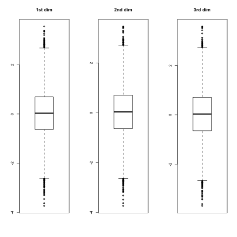  
*Gráfico Boxplot para r=0.99 e amostras 100, 1000 e 10000*

Finalmente, para confirmar que as normais geradas são realmente distribuições normais, os gráficos a seguir mostram os histogramas de seus elementos de cada uma de suas dimensões.

Os histogramas estão agrupados pela correlação escolhida (0, .9, .99). É possível notar que os gráficos de histograma mostram que a distribuição é simétrica em relação ao desvio padrão **&#961;** e a densidade desenhada sobre o histograma, que representa a *Função de Densidade de Probabilidade*, é próxima de uma curva gaussiana.

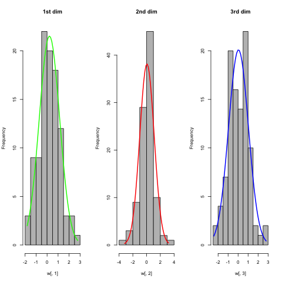  
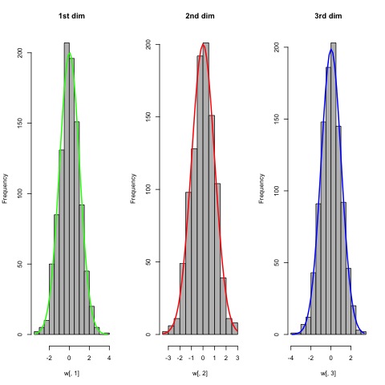  
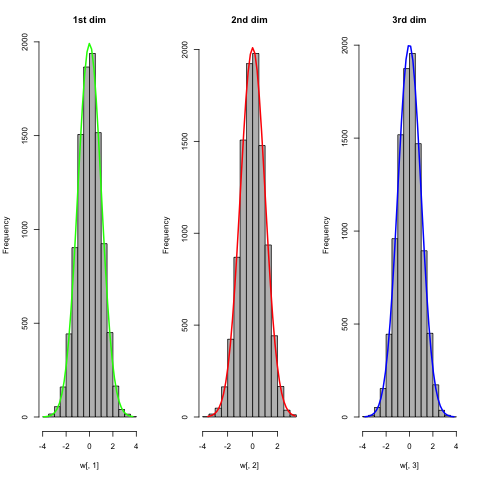  
*Histograma e densidade  para r=0.0 e amostras 100, 1000 e 10000*

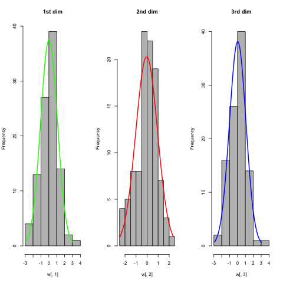  
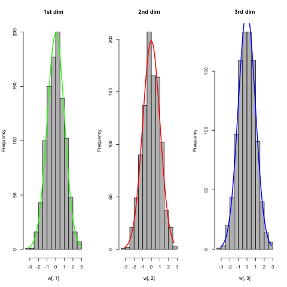  
  
*Histograma e densidade para r=0.9 e amostras 100, 1000 e 10000*

  
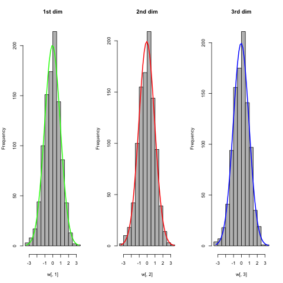  
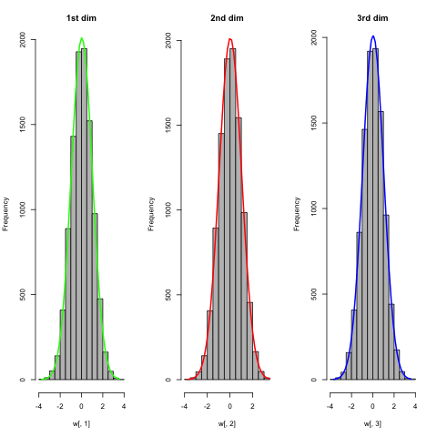  
*Histograma e densidade para r=0.99 e amostras 100, 1000 e 10000*

Conclui-se, então que o método utilizado para a geração da normal a partir da variância e correlação produz uma distribuição normal trivariada, como pode ser observado visualmente e pela comparação das matrizes **&#931;** gerada e calculada a partir de **r**.
