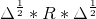
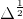

# Treinamento Métodos Gaussianos de Aprendizagem de Máquina
___
## Exercício Aula 1

> Escreva um programa no R para gerar números do vetor aleatório
normalmente distribuído com variâncias todas iguais a 1 (um) e
correlações todas iguais a um dos valores no conjunto
{−0, 9; 0, 0; 0, 9; 0, 99}, e varie o tamanho das amostras geradas para
cada matriz de covariâncias (por exemplo, 100, 1000, etc).  
Considere
uma normal trivariada para este exercício. Faça diversos gráficos para
analisar os conjuntos de dados gerados. Por exemplo box-plot,
histogramas, qq-plot, dispersão dois a dois, etc. É importante neste
exercício que você trabalhe com a matriz de dados de acordo com a
parte teórica da matéria, ou seja, salve os dados gerados em uma
matriz p × n.  
Dica: verificar as funções boxplot, *hist*, *qqnorm* e *plot* do programa R.

### Solução
O exercício solicita uma distribuição normal trivariada. Desta forma, o número *p* de variáveis é **3**.  
No enunciado também foi definido que a variância **s** é **1**.  
Assim, temos como variáveis iniciais:  

| Variável | Valor |  
| -------- |:-----:|  
| *p*      | 3     |  
| *s*      | 1     |  
| *r*      | {-.9,0,.9,.99} |  
| *n*      | {100,1000,10000} |  

Para iniciar o exercício, primeiro é preciso encontrar a matriz de covariância **&#931;**. Ela é obtida pela equação   
Os passos para calcular a matriz **&#931;** a partir da Variância e Correlação são:
1. Criar uma matriz de correlação **R**
  1. Definir uma matriz *p*X*p* com valores iguais à correlação escolhida
  2. Definir a diagonal da matriz **R** para 1, pois a matriz de correlação tem diagonal 1 (correlação entre um elemento e ele mesmo **r<sub>ii<sub>**)
2. Calcular o desvio padrão **&#961;** igual a 
3. Calcular   igual a matriz diagonal de **&#961;**
4. Calcular a matriz de covariância **&#931;** =   

A matriz de covariância é simétrica **&#931;** = **&#931;**<sup>'</sup> e positiva definida - seus auto valores são todos maiores ou iguais a 0 (zero)  
Dessa forma, a primeira opção de *r*=-.9 gera uma matriz que não é positiva definida, portando, este valor de correlação é descartado.  
Para gerar a normal trivariada, utiliza-se a função `rmvnorm` do pacote **mvtnorm**.

```R
## num.amostras é o número de amostras escolhido entre 100,1000,10000
## mean = c(0,0,0) centra a normal na origem
## sigma é a matriz **&#931;** calculada
w <<- rmvnorm(num.amostras,mean = c(0,0,0),sigma = Sigma)
head(w)
        [,1]        [,2]        [,3]
[1,] -0.1090921 -0.03828476 -0.11619513
[2,]  0.1533679  0.18842449  0.06760031
[3,] -0.8254751 -0.89191302 -1.10961539
[4,] -1.2262424 -1.06567391 -1.16657697
[5,] -1.6802752 -1.72108468 -1.79692971
[6,]  1.3113248  1.51770857  1.39245846
```  
O script R [Exercicio 01](./exercicio_01.R) define 3 funções para calcular os parâmetros necessários para o exercício:  
* analisa_matriz: recebe os índices escolhidos para correlação e tamanho da normal e se deve-se salvar os gráficos em arquivos .PNG;
* calcula.sigma: recebe um valor de variância e um de correlação e calcula a matriz de covariância **&#931;** conforme explicação acima;
* matriz.eh.positiva.definida: valida se a matriz **&#931;** é positiva definida

Além disso, o script faz a análise de cada correlação (-.9,0,.9,.99) para cada tamanho da normal (100,1000,10000).  

A pasta [images](./images) contém os gráficos obtidos a partir da execução combinada de correlação e tamanho da normal. Os tipos de gráfico são:
* boxplot
* densidade (curva de densidade do histograma)
* hist (histograma)
* pairs (dispersão dois a dois)
* qqnorm

O padrão de nomeação dos arquivos é `<tipo de grafico>_<numcorrelacao>_<tamanho>.png`.  

### Análise  
